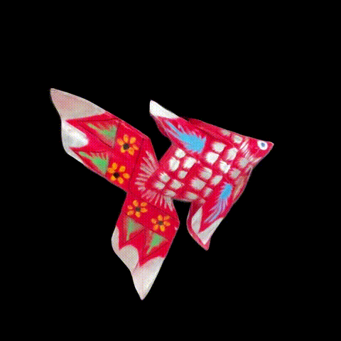
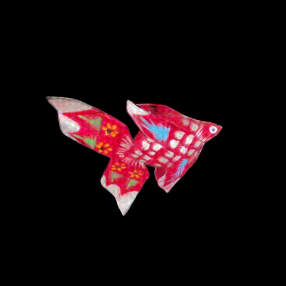

# Pla Tapian Bai Lan 3D reconstruction





## Folder contents

```text
final_submission/
├── source/                 local original recordings, ignored by Git
├── masks/                  local scratch masks, ignored by Git
├── work/latest/            submitted images, labels, masks, cameras, and training data
├── outputs/
│   ├── models/             Gaussian-splat PLY models
│   ├── videos/             final MP4 rotations
│   ├── previews/           README GIFs and mask preview
│   └── interactive_viewer/ browser viewer for the PLY models
└── scripts/                final reconstruction workflow
```


## Download the masks and models

The masks, prepared work files, and model outputs are stored in the shared [Google Drive folder](https://drive.google.com/drive/folders/1GYrtH-BxeDGc33KMJ6MtSCnZFXVQv48m?usp=sharing). Download the `masks`, `work`, and `outputs` folders and merge them into the matching folders in this repository.

## View the final model

After downloading the models, double-click `outputs/interactive_viewer/start-viewer.command` on macOS. The first launch installs the viewer packages, starts a local web page, and opens it in the browser. The models stay on the computer.

Use the mouse or the W, A, S, and D keys to rotate. Use Z and X to zoom. Press Space to pause or resume automatic rotation.

## Run the workflow
The checked-in `work/latest` folder already contains the final prepared set, so `scripts/train.py` can run without the original videos which are omitted for privacy.

First run `scripts/setup.py` once. It creates `scripts/.venv` and installs the Python packages. Internet access is needed for setup.

Then run either of these Python files from an editor such as VS Code or PyCharm:

- `scripts/run_workflow.py` runs preprocessing and training from start to finish.
- `scripts/preprocess.py` runs for frames, masks, camera estimation, and training-data preparation. 
- `scripts/train.py` trains from the masks and prepared data. Use this after preprocessing if you want to run the two stages separately.

During preprocessing, draw a rectangle around the main fish when asked. The script opens `mask_preview.jpg` before training. Check that the fish is visible and most of the background is black, then return to the prompt and continue.

The masks and prepared training data under `work/latest` are the reviewed final set. A new run writes its model to `outputs/models/new_run_model.ply` and keeps its run record in `work/latest`.

## Final outputs

- `outputs/models/final_clean_model.ply` is the cleaned final presentation model.
- `outputs/models/normal_top_model.ply` is the model trained with video and upper photographs before cleanup.
- `outputs/models/normal_video_model.ply` is the two-video model before the upper-photo continuation.
- `outputs/videos/final_side_360.mp4` is the final level rotation.
- `outputs/videos/final_upper_360.mp4` is the final elevated rotation.

The top photographs improved details on the photographed upper side.

## Software notes

The final workflow uses SAM 2.1 for foreground masks, COLMAP through PyCOLMAP for camera estimation, and Brush 0.3.0 for Gaussian-splat training on Metal. `scripts/setup.py` downloads the SAM checkpoint and extracts the Brush application.

The earlier custom Gaussian implementation is kept in `scripts/souvenir`. It records an earlier stage of the project and is not called by the final workflow.
